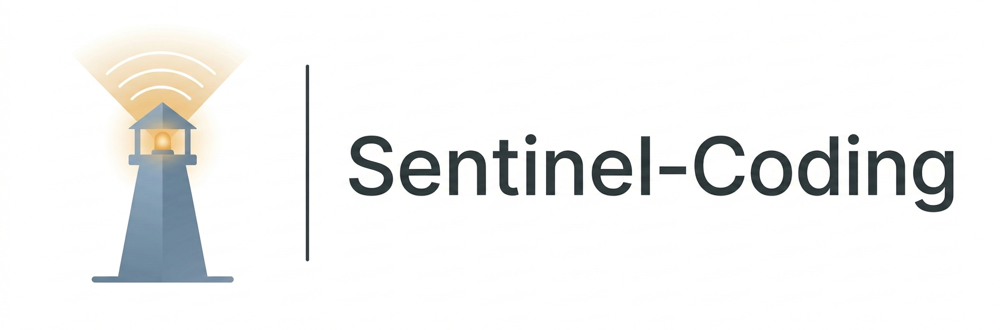

<div align="center">



Automatically maintains project docs and tool configs so Claude Code always reads the latest project state

[](LICENSE)
[]()
[]()

English | [中文文档](./README.md)

</div>

---

## TL;DR

Sentinel is a set of Claude Code plugins. It maintains an auto-syncing documentation hierarchy in your repository (project-level, directory-level, file-level), so Claude reads the latest code and architecture state every time it starts a new session — not outdated docs or stale context from a previous conversation. It also manages tool usage rules — explicitly constraining which tools Claude should and shouldn't use.

Goal: AI understanding of your project on session 50 is as accurate as session 1.

<div align="center">

[](https://youtu.be/fgbWpdtwSLU)

*Click the image to watch the demo video*

</div>

---

## What It Does

- **Maintains a three-layer doc hierarchy**: project-level architecture snapshot, directory-level module manifests, file-level descriptions (inputs/outputs/role) — each layer auto-syncs after code changes
- **Manages tool routing**: scans available skills and MCP tools, generates routing declarations telling Claude what to use and what not to use
- **Preserves lessons across sessions**: structurally records constraints and pitfalls discovered during development, auto-loaded in the next session to avoid repeating mistakes

---

## Problems You've Probably Hit

If you've used Claude Code on a project for more than a week, you've likely encountered these. They're not about "writing better prompts" — they're about project information falling out of sync with code, leaving the AI working from stale context.

**1. Docs fall behind, AI doesn't notice**

You switched from PostgreSQL to SQLite three weeks ago, but ARCHITECTURE.md was never updated. Claude starts a new session, reads the old doc, and writes PostgreSQL-style code — coherent, reasonable, and completely wrong. You don't find out until tests fail.

**2. Too many tools, AI picks the wrong one**

Your project has dozens of skills and MCP tools with no explicit constraints on which ones apply. Claude picks a tool with similar functionality but the wrong data scope, gets an empty result, and concludes "the data doesn't exist" — the reasoning is flawless, it just asked the wrong tool.

**3. Lessons from last session don't carry over**

Last session you discovered "bulk inserts can't use ORM, use raw SQL." Claude fixed it on the spot. Next session, same scenario, Claude generates ORM bulk inserts again — because that discovery only lived in the previous chat history, never written to any persistent doc.

Sentinel turns these from "hope someone remembers to update the docs" into "the system handles it automatically" — through auto-syncing docs, constraining tool routing, and structurally preserving lessons learned.

---

## Who Should Use It / Who Shouldn't

**Good fit**:
- Developers using Claude Code for multi-session projects
- Projects large enough that the AI starts "forgetting" earlier decisions
- Want project docs to auto-update with code changes instead of manual maintenance

**Not a good fit**:
- Short-lived scripts or throwaway projects
- Projects not using Claude Code
- Teams requiring real-time multi-user collaboration (current design targets solo developer workflows)

---

## 1-Minute Quick Start

```bash
git clone https://github.com/your-username/sentinel-coding.git my-project
cd my-project && git init
pip install -r requirements.txt
```

In Claude Code:

```
/start              # Guided interview → generates PRD, ARCHITECTURE, CLAUDE.md, progress.yaml
/routing            # Scans available tools → generates tool routing report (you approve)
/boundary           # Based on your approval → generates tool boundary declarations
```

---

## What Gets Added to Your Project

| File | Purpose | Managed by |
|------|---------|------------|
| `PRD.md` | Product requirements | Human (generated by `/start`, then human-maintained) |
| `ARCHITECTURE.md` | Architecture snapshot | Human (generated by `/start`, then human-maintained) |
| `CLAUDE.md` (root) | Rules and constraints | Human (compaction proposes, human approves) |
| `progress.yaml` | Session log intake | AI (appended by `/progress`) |
| `CLAUDE.md` (per-directory) | Directory manifests | AI (chain-trigger auto-sync) |
| YAML front matter | File-level metadata | AI (chain-trigger auto-sync) |
| `docs/tool-routing-report.md` | Tool inventory | AI generates, human approves |
| `.claude/rules/tool-boundary.md` | Tool boundary declarations | AI (generated by `/boundary`) |

---

## Core Workflow

Three pillars:

1. **Document lifecycle**: `/start` bootstraps → chain-trigger auto-syncs → `/progress` logs discoveries → compaction promotes to `CLAUDE.md`
2. **Tool routing**: `/routing` inventories tools → human approves → `/boundary` generates declarations → auto-loaded every session
3. **Three-tier review**: Tier 1 deterministic prechecks → Tier 2 cross-LLM review (Codex) → Tier 3 self-review fallback

---

## Features at a Glance

| Command | Description |
|---------|-------------|
| `/start` | Bootstrap a new project with PRD, ARCHITECTURE, and CLAUDE.md through a guided interview |
| `/routing` | Scan global skills against project context and produce a tool routing report |
| `/boundary` | Generate tool boundary declarations from an approved routing report |
| `/sentinel-loop` | Propose a Ralph Loop iteration based on current project state |
| `/progress` | Generate a structured progress.yaml entry with typed Candidates |
| `/export` | Compliance lint + format rendering for submission-ready documents |
| `/call-codex` | Invoke Codex CLI from within Claude Code for a second opinion |
| `/submit-issue` | Submit bug reports or feature requests to GitHub directly from Claude Code |

---

## Architecture Overview

```
sentinel-coding/
├── .claude/skills/            # 8 slash commands (human-invoked)
│   ├── start/                 # Project bootstrap
│   ├── routing/               # Tool scanning
│   ├── boundary/              # Boundary generation
│   ├── sentinel-loop/         # Iterative development
│   ├── progress/              # Session logging
│   ├── export/                # Document export
│   ├── call-codex/            # Codex integration
│   └── submit-issue/          # Issue submission
├── .sentinel/                 # SDK runtime (hidden directory)
│   ├── chain_trigger/         # Auto-sync pipeline (prechecks → cross-review → self-review)
│   ├── compaction/            # Knowledge promotion (progress.yaml → CLAUDE.md)
│   ├── writeback/             # progress.yaml I/O
│   ├── export/                # AI writing pattern compliance checks
│   ├── hooks/                 # Git pre-commit hook (soft warnings, never blocks)
│   ├── templates/             # 7 document templates
│   └── scripts/               # Production extraction
└── docs/
    └── getting-started.md     # Detailed documentation
```

---

## Customization

- **Templates**: Edit files in `.sentinel/templates/` to change generated document structures
- **Compliance rules**: Extend `.sentinel/export/compliance.py` to add new AI writing pattern detectors
- **Skills**: Create new skills at `.claude/skills/{name}/SKILL.md`
- **Hooks**: Modify check scripts in `.sentinel/hooks/lib/`
- **Tool routing**: Edit `docs/tool-routing-report.md` and re-run `/boundary`

---

## Limitations and Assumptions

- Requires Claude Code (not compatible with other AI coding tools)
- Requires Python 3.11+ (for `StrEnum`, type union syntax, etc.)
- Hooks are soft warnings only — they alert but never block commits
- `/call-codex` requires separate Codex CLI installation
- `/submit-issue` requires GitHub CLI installed and authenticated (`gh auth login`)
- `/sentinel-loop` requires the Ralph Loop plugin
- Designed for single-developer workflows; no multi-user conflict resolution
- Current version (v0.1.0) is experimental; interfaces may change

---

## Install

```bash
git clone https://github.com/your-username/sentinel-coding.git my-project
cd my-project && git init
pip install -r requirements.txt
# In Claude Code: /start
```

## Hook Behavior (Transparency)

- `pre-commit`: Runs `check_headers.sh` and `check_dir_docs.sh`. Outputs warnings on stderr. Always exits 0. Never blocks commits. Never modifies files.

---

## Contributing

See [CONTRIBUTING.md](CONTRIBUTING.md) for how to contribute.

---

## License

MIT License — see [LICENSE](LICENSE)
